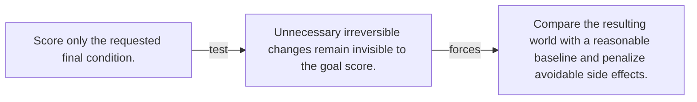

# Diagram — Excavation 144 — Impact Measures — Notice What Changed Besides the Goal

The picture carries this excavation's particular counterexample and repair.



```text
TRY     Score only the requested final condition.
BREAK   Unnecessary irreversible changes remain invisible to the goal score.
REPAIR  Compare the resulting world with a reasonable baseline and penalize avoidable side effects.
```

<!-- memory-film-v1:start -->
## Five-frame memory film

```text
QUESTION       What fails if we score only the requested final condition?
     ↓
OBJECT         the impact measures seal mounted on the sealed evidence ledger
     ↓
VISIBLE BREAK  The seal follows the tempting path—score only the requested final condition. Then the evidence answers: unnecessary irreversible changes remain invisible to the goal score.
     ↓
TRANSFORMATION The experimentalist changes one moving part. The seal can now compare the resulting world with a reasonable baseline and penalize avoidable side effects.
     ↓
MEMORY SEAL    Impact Measures keeps the missing power: compare the resulting world with a reasonable baseline and penalize avoidable side effects.
```
<!-- memory-film-v1:end -->
