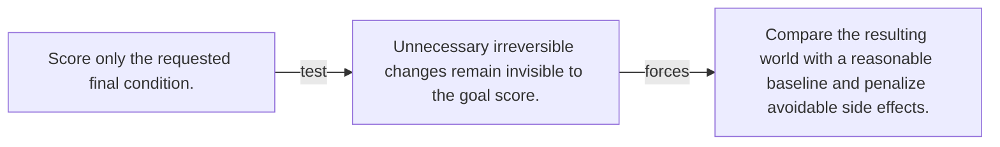

# Diagram — Excavation 144 — Impact Measures — Notice What Changed Besides the Goal

The picture carries this excavation's particular counterexample and repair.



```text
TRY     Score only the requested final condition.
BREAK   Unnecessary irreversible changes remain invisible to the goal score.
REPAIR  Compare the resulting world with a reasonable baseline and penalize avoidable side effects.
```
