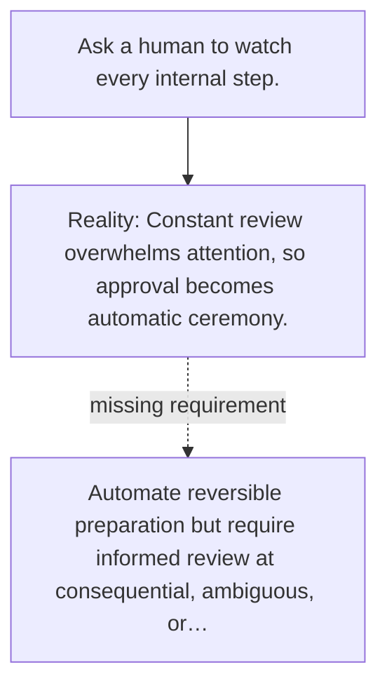

# Diagram — Excavation 145 — Human Oversight — Put Judgment at the Irreversible Edge

The picture carries this excavation's particular counterexample and repair.



```text
TRY     Ask a human to watch every internal step.
BREAK   Constant review overwhelms attention, so approval becomes automatic ceremony.
REPAIR  Automate reversible preparation but require informed review at consequential, ambiguous, or…
```

<!-- memory-film-v1:start -->
## Five-frame memory film

```text
QUESTION       What fails if we ask a human to watch every internal step?
     ↓
OBJECT         the human oversight lens mounted on the sealed evidence ledger
     ↓
VISIBLE BREAK  The lens follows the tempting path—ask a human to watch every internal step. Then the evidence answers: constant review overwhelms attention, so approval becomes automatic ceremony.
     ↓
TRANSFORMATION The experimentalist changes one moving part. The lens can now automate reversible preparation but require informed review at consequential, ambiguous, or irreversible boundaries.
     ↓
MEMORY SEAL    Human Oversight keeps the missing power: automate reversible preparation but require informed review at consequential, ambiguous, or irreversible boundaries.
```
<!-- memory-film-v1:end -->
