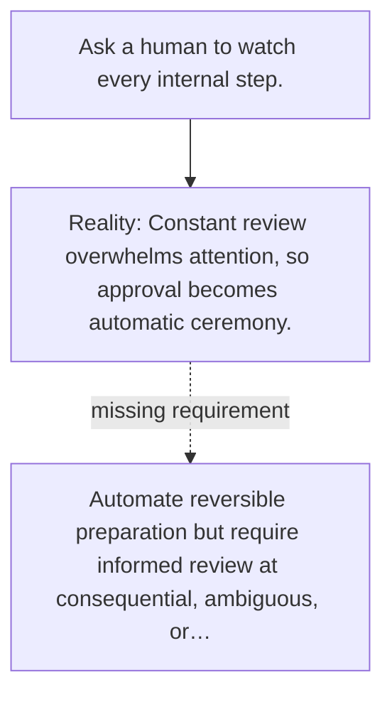

# Diagram — Excavation 145 — Human Oversight — Put Judgment at the Irreversible Edge

The picture carries this excavation's particular counterexample and repair.



```text
TRY     Ask a human to watch every internal step.
BREAK   Constant review overwhelms attention, so approval becomes automatic ceremony.
REPAIR  Automate reversible preparation but require informed review at consequential, ambiguous, or…
```
