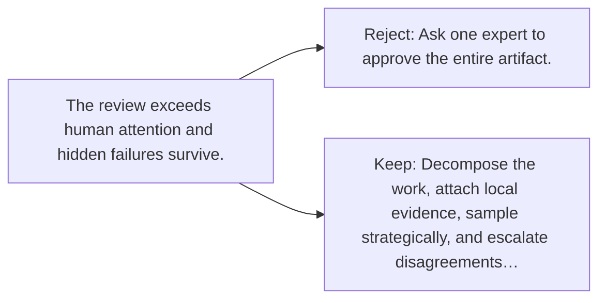

# Diagram — Excavation 146 — Scalable Oversight — Reviewing Work Too Large for One Person

The picture carries this excavation's particular counterexample and repair.



```text
TRY     Ask one expert to approve the entire artifact.
BREAK   The review exceeds human attention and hidden failures survive.
REPAIR  Decompose the work, attach local evidence, sample strategically, and escalate disagreements…
```

<!-- memory-film-v1:start -->
## Five-frame memory film

```text
QUESTION       What fails if we ask one expert to approve the entire artifact?
     ↓
OBJECT         the scalable oversight key mounted on the sealed evidence ledger
     ↓
VISIBLE BREAK  The key follows the tempting path—ask one expert to approve the entire artifact. Then the evidence answers: the review exceeds human attention and hidden failures survive.
     ↓
TRANSFORMATION The experimentalist changes one moving part. The key can now decompose the work, attach local evidence, sample strategically, and escalate disagreements or high-risk regions.
     ↓
MEMORY SEAL    Scalable Oversight keeps the missing power: decompose the work, attach local evidence, sample strategically, and escalate disagreements or high-risk regions.
```
<!-- memory-film-v1:end -->
