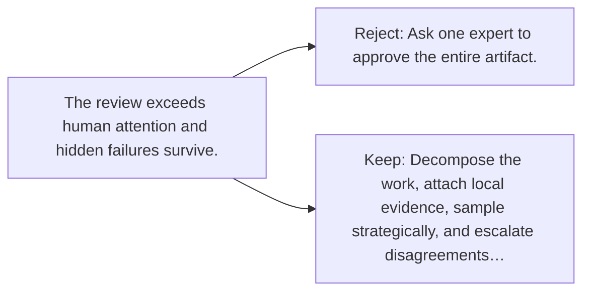

# Diagram — Excavation 146 — Scalable Oversight — Reviewing Work Too Large for One Person

The picture carries this excavation's particular counterexample and repair.



```text
TRY     Ask one expert to approve the entire artifact.
BREAK   The review exceeds human attention and hidden failures survive.
REPAIR  Decompose the work, attach local evidence, sample strategically, and escalate disagreements…
```
