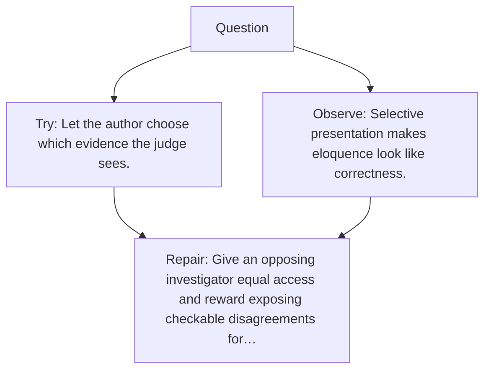

# Diagram — Excavation 147 — Debate — Let Claims Meet an Adversary

The picture carries this excavation's particular counterexample and repair.



```text
TRY     Let the author choose which evidence the judge sees.
BREAK   Selective presentation makes eloquence look like correctness.
REPAIR  Give an opposing investigator equal access and reward exposing checkable disagreements for…
```
