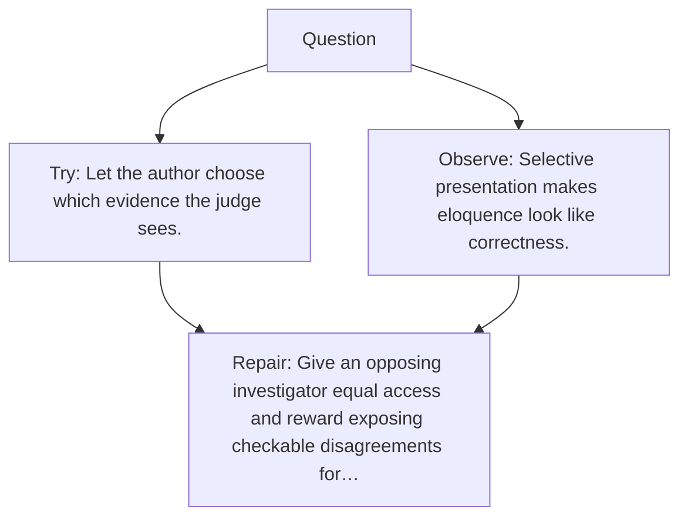

# Diagram — Excavation 147 — Debate — Let Claims Meet an Adversary

The picture carries this excavation's particular counterexample and repair.



```text
TRY     Let the author choose which evidence the judge sees.
BREAK   Selective presentation makes eloquence look like correctness.
REPAIR  Give an opposing investigator equal access and reward exposing checkable disagreements for…
```

<!-- memory-film-v1:start -->
## Five-frame memory film

```text
QUESTION       What fails if we let the author choose which evidence the judge sees?
     ↓
OBJECT         the debate lantern mounted on the sealed evidence ledger
     ↓
VISIBLE BREAK  The lantern follows the tempting path—let the author choose which evidence the judge sees. Then the evidence answers: the trouble appears immediately: selective presentation makes eloquence look like correctness.
     ↓
TRANSFORMATION The experimentalist changes one moving part. The lantern can now give an opposing investigator equal access and reward exposing checkable disagreements for a judge.
     ↓
MEMORY SEAL    Debate keeps the missing power: give an opposing investigator equal access and reward exposing checkable disagreements for a judge.
```
<!-- memory-film-v1:end -->
