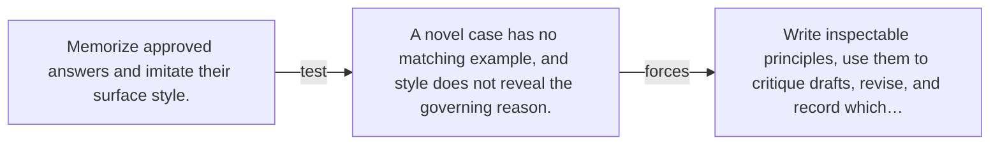

# Diagram — Excavation 148 — Constitutional Guidance — Rules That Can Critique Answers

The picture carries this excavation's particular counterexample and repair.



```text
TRY     Memorize approved answers and imitate their surface style.
BREAK   A novel case has no matching example, and style does not reveal the governing reason.
REPAIR  Write inspectable principles, use them to critique drafts, revise, and record which…
```
