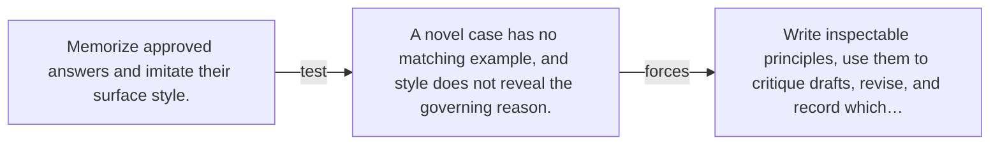

# Diagram — Excavation 148 — Constitutional Guidance — Rules That Can Critique Answers

The picture carries this excavation's particular counterexample and repair.



```text
TRY     Memorize approved answers and imitate their surface style.
BREAK   A novel case has no matching example, and style does not reveal the governing reason.
REPAIR  Write inspectable principles, use them to critique drafts, revise, and record which…
```

<!-- memory-film-v1:start -->
## Five-frame memory film

```text
QUESTION       What fails if we memorize approved answers and imitate their surface style?
     ↓
OBJECT         the constitutional guidance compass mounted on the sealed evidence ledger
     ↓
VISIBLE BREAK  The compass follows the tempting path—memorize approved answers and imitate their surface style. Then the evidence answers: a novel case has no matching example, and style does not reveal the governing reason.
     ↓
TRANSFORMATION The experimentalist changes one moving part. The compass can now write inspectable principles, use them to critique drafts, revise, and record which principle controlled the change.
     ↓
MEMORY SEAL    Constitutional Guidance keeps the missing power: write inspectable principles, use them to critique drafts, revise, and record which principle controlled the change.
```
<!-- memory-film-v1:end -->
