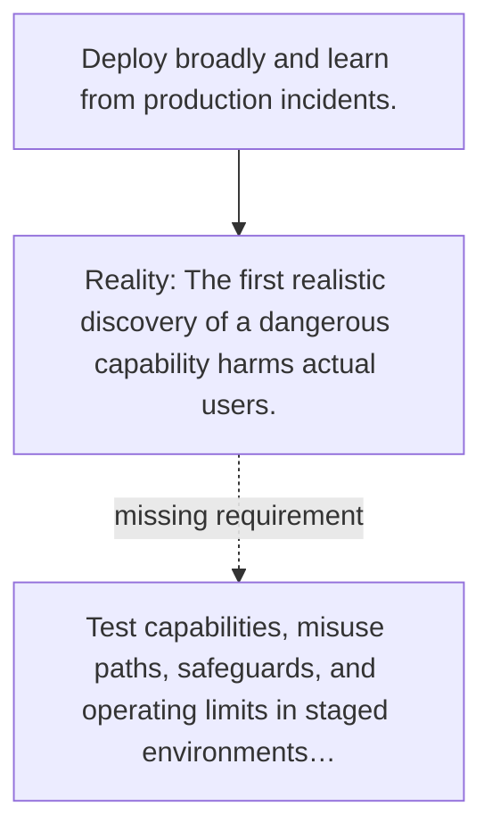

# Diagram — Excavation 149 — Pre-Deployment Evaluations — Fail Before the World Pays

The picture carries this excavation's particular counterexample and repair.



```text
TRY     Deploy broadly and learn from production incidents.
BREAK   The first realistic discovery of a dangerous capability harms actual users.
REPAIR  Test capabilities, misuse paths, safeguards, and operating limits in staged environments…
```

<!-- memory-film-v1:start -->
## Five-frame memory film

```text
QUESTION       What fails if we deploy broadly and learn from production incidents?
     ↓
OBJECT         the pre-deployment evaluations bridge mounted on the sealed evidence ledger
     ↓
VISIBLE BREAK  The bridge follows the tempting path—deploy broadly and learn from production incidents. Then the evidence answers: the first realistic discovery of a dangerous capability harms actual users.
     ↓
TRANSFORMATION The experimentalist changes one moving part. The bridge can now test capabilities, misuse paths, safeguards, and operating limits in staged environments before granting authority.
     ↓
MEMORY SEAL    Pre-Deployment Evaluations keeps the missing power: test capabilities, misuse paths, safeguards, and operating limits in staged environments before granting authority.
```
<!-- memory-film-v1:end -->
