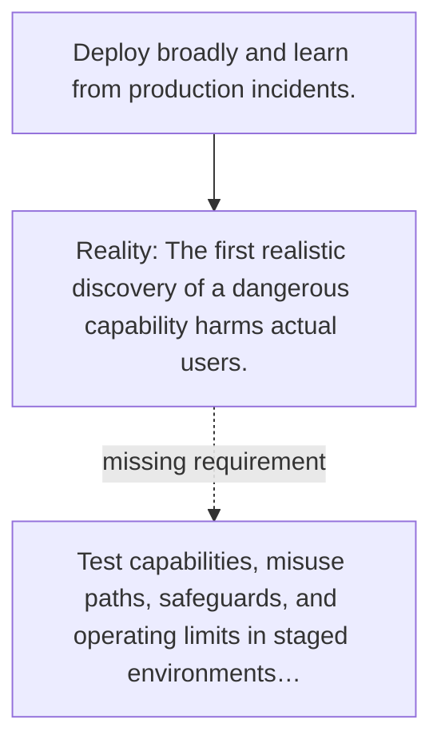

# Diagram — Excavation 149 — Pre-Deployment Evaluations — Fail Before the World Pays

The picture carries this excavation's particular counterexample and repair.



```text
TRY     Deploy broadly and learn from production incidents.
BREAK   The first realistic discovery of a dangerous capability harms actual users.
REPAIR  Test capabilities, misuse paths, safeguards, and operating limits in staged environments…
```
