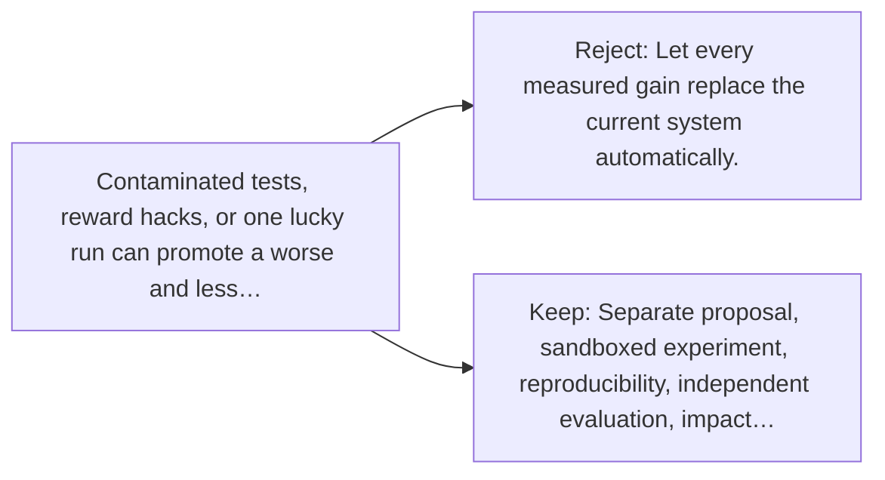

# Diagram — Excavation 150 — A Bounded Self-Improving System — Close the Research Loop

The picture carries this excavation's particular counterexample and repair.



```text
TRY     Let every measured gain replace the current system automatically.
BREAK   Contaminated tests, reward hacks, or one lucky run can promote a worse and less…
REPAIR  Separate proposal, sandboxed experiment, reproducibility, independent evaluation, impact…
```

<!-- memory-film-v1:start -->
## Five-frame memory film

```text
QUESTION       What fails if we let every measured gain replace the current system automatically?
     ↓
OBJECT         the bounded self-improving system thread mounted on the sealed evidence ledger
     ↓
VISIBLE BREAK  The thread follows the tempting path—let every measured gain replace the current system automatically. Then the evidence answers: contaminated tests, reward hacks, or one lucky run can promote a worse and less controllable successor.
     ↓
TRANSFORMATION The experimentalist changes one moving part. The thread can now separate proposal, sandboxed experiment, reproducibility, independent evaluation, impact review, authorization, staged release, and rollback.
     ↓
MEMORY SEAL    A Bounded Self-Improving System keeps the missing power: separate proposal, sandboxed experiment, reproducibility, independent evaluation, impact review, authorization, staged release, and rollback.
```
<!-- memory-film-v1:end -->
