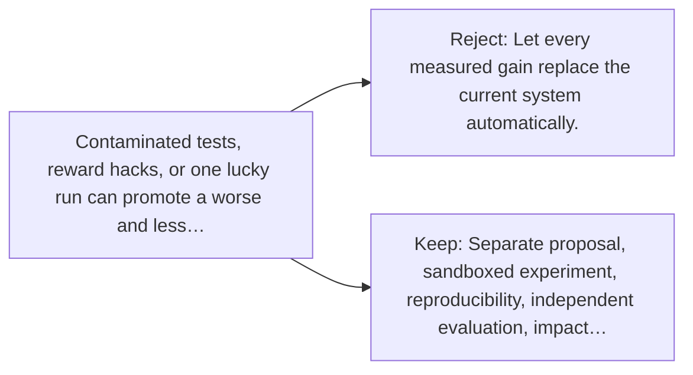

# Diagram — Excavation 150 — A Bounded Self-Improving System — Close the Research Loop

The picture carries this excavation's particular counterexample and repair.



```text
TRY     Let every measured gain replace the current system automatically.
BREAK   Contaminated tests, reward hacks, or one lucky run can promote a worse and less…
REPAIR  Separate proposal, sandboxed experiment, reproducibility, independent evaluation, impact…
```
