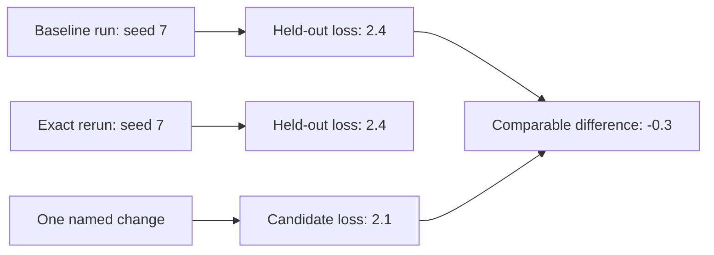

# Diagram — A Reproducible Baseline — Improve Something That Actually Exists



```text
fixed world + one change -> attributable evidence
```

<!-- memory-film-v1:start -->
## Five-frame memory film

```text
QUESTION       What fails if we keep the final score and the model file; those should be enough to compare the next idea?
     ↓
OBJECT         the reproducible baseline mirror mounted on the brass reference machine
     ↓
VISIBLE BREAK  The mirror follows the tempting path—keep the final score and the model file; those should be enough to compare the next idea. Then the evidence answers: a rerun changes the data order, random seed, tokenizer revision, and library behavior. Its score moves even though the proposed improvement was never applied.
     ↓
TRANSFORMATION The enginewright changes one moving part. The mirror can now freeze the model specification, data snapshot, seed, environment, training budget, and evaluation procedure as one named baseline.
     ↓
MEMORY SEAL    A Reproducible Baseline keeps the missing power: freeze the model specification, data snapshot, seed, environment, training budget, and evaluation procedure as one named baseline.
```
<!-- memory-film-v1:end -->
