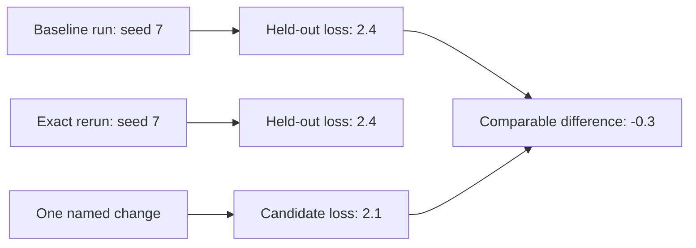

# Diagram — A Reproducible Baseline — Improve Something That Actually Exists


```mermaid
flowchart LR
    B1["Baseline run: seed 7"] --> M1["Held-out loss: 2.4"]
    B2["Exact rerun: seed 7"] --> M2["Held-out loss: 2.4"]
    C["One named change"] --> M3["Candidate loss: 2.1"]
    M1 --> D["Comparable difference: -0.3"]
    M3 --> D
```

```text
fixed world + one change -> attributable evidence
```
