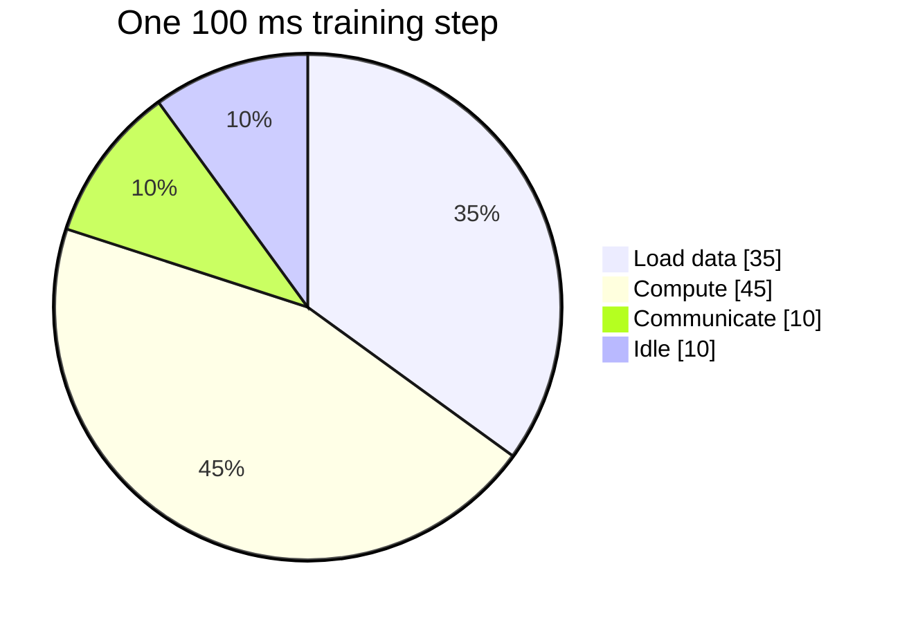

# Diagram — Profiling — Measure Where the Time Went



```text
0 ms |---data 35---|-----compute 45-----|-comm 10-|-idle 10-| 100 ms
```

<!-- memory-film-v1:start -->
## Five-frame memory film

```text
QUESTION       What fails if we optimize the largest-looking matrix because attention is famous for being expensive?
     ↓
OBJECT         the profiling bell mounted on the brass reference machine
     ↓
VISIBLE BREAK  The bell follows the tempting path—optimize the largest-looking matrix because attention is famous for being expensive. Then the evidence answers: the device spends much of the run waiting for data and moving tensors. Making one matrix faster barely changes the wall clock.
     ↓
TRANSFORMATION The enginewright changes one moving part. The bell can now measure data loading, computation, communication, and idle time separately before choosing a repair.
     ↓
MEMORY SEAL    Profiling keeps the missing power: measure data loading, computation, communication, and idle time separately before choosing a repair.
```
<!-- memory-film-v1:end -->
