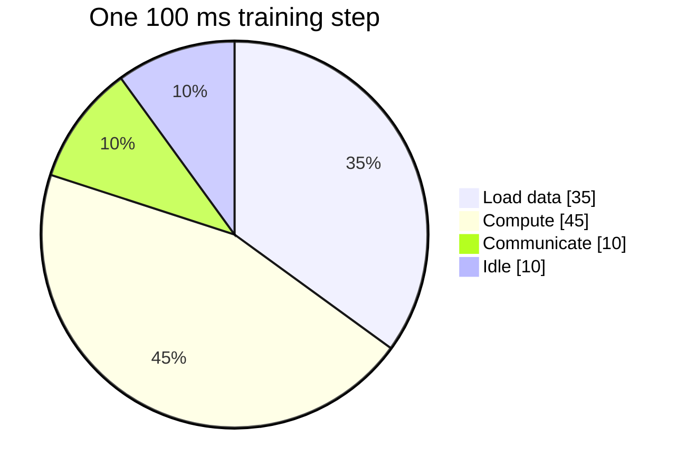

# Diagram — Profiling — Measure Where the Time Went


```mermaid
pie showData
    title One 100 ms training step
    "Load data" : 35
    "Compute" : 45
    "Communicate" : 10
    "Idle" : 10
```

```text
0 ms |---data 35---|-----compute 45-----|-comm 10-|-idle 10-| 100 ms
```
