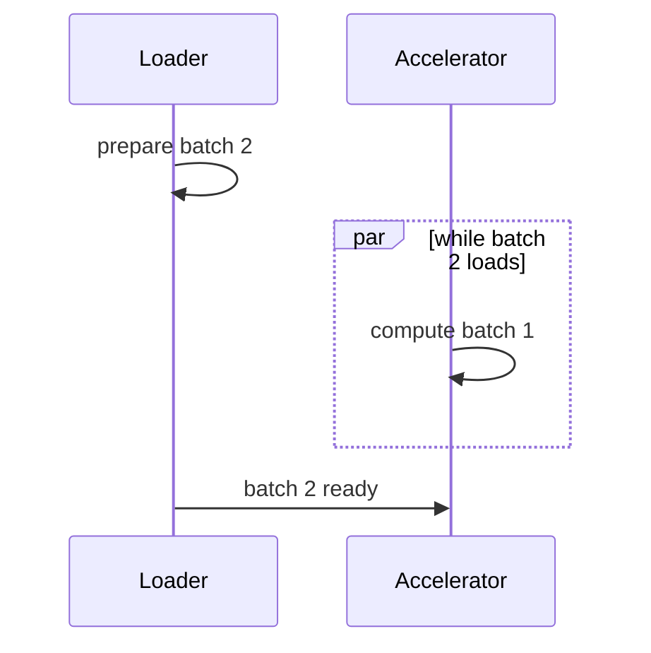

# Diagram — The Input Pipeline — Stop Making the Accelerator Wait


```mermaid
sequenceDiagram
    participant Loader
    participant Accelerator
    Loader->>Loader: prepare batch 2
    par while batch 2 loads
        Accelerator->>Accelerator: compute batch 1
    end
    Loader->>Accelerator: batch 2 ready
```

```text
serial:  [load 35][compute 45] = 80 ms
overlap: [load 35]
         [compute 45]          = 45 ms steady state
```
