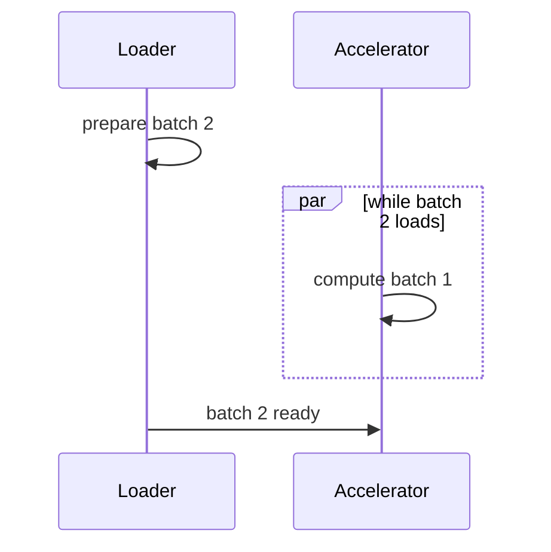

# Diagram — The Input Pipeline — Stop Making the Accelerator Wait



```text
serial:  [load 35][compute 45] = 80 ms
overlap: [load 35]
         [compute 45]          = 45 ms steady state
```

<!-- memory-film-v1:start -->
## Five-frame memory film

```text
QUESTION       What fails if we load a batch, wait until loading finishes, compute it, and only then begin loading the next one?
     ↓
OBJECT         the input pipeline vessel mounted on the brass reference machine
     ↓
VISIBLE BREAK  The vessel follows the tempting path—load a batch, wait until loading finishes, compute it, and only then begin loading the next one. Then the evidence answers: data time and compute time are paid sequentially on every step, leaving expensive compute hardware idle.
     ↓
TRANSFORMATION The enginewright changes one moving part. The vessel can now prepare the next batch while the current batch computes, using bounded prefetching and deterministic ordering.
     ↓
MEMORY SEAL    The Input Pipeline keeps the missing power: prepare the next batch while the current batch computes, using bounded prefetching and deterministic ordering.
```
<!-- memory-film-v1:end -->
