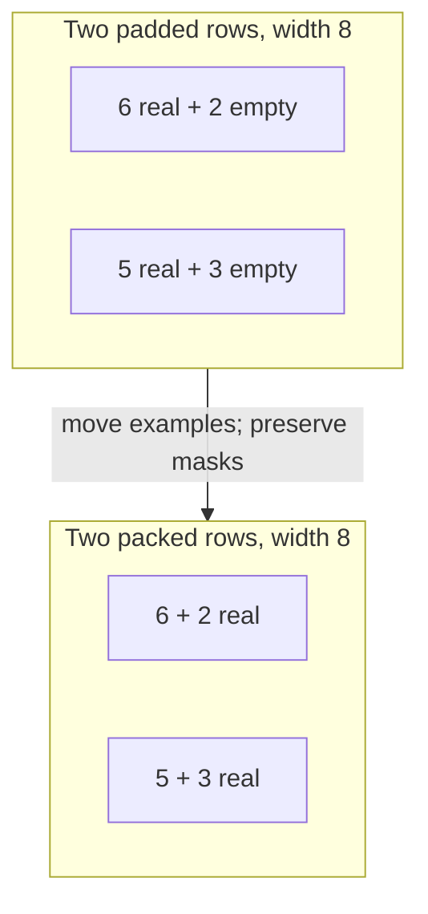

# Diagram — Sequence Packing — Stop Training on Empty Space



```text
before: T T T T T T _ _   T T T T T _ _ _
after:  T T T T T T T T   T T T T T T T T
```

<!-- memory-film-v1:start -->
## Five-frame memory film

```text
QUESTION       What fails if we pad every sentence to the longest sentence in its batch and trust the loss mask to ignore the waste?
     ↓
OBJECT         the sequence packing gate mounted on the brass reference machine
     ↓
VISIBLE BREAK  The gate follows the tempting path—pad every sentence to the longest sentence in its batch and trust the loss mask to ignore the waste. Then the evidence answers: the loss ignores padding, but attention and matrix multiplication still spend time and memory carrying those empty positions.
     ↓
TRANSFORMATION The enginewright changes one moving part. The gate can now pack several short examples into each fixed-length row and mask their boundaries so examples cannot read one another.
     ↓
MEMORY SEAL    Sequence Packing keeps the missing power: pack several short examples into each fixed-length row and mask their boundaries so examples cannot read one another.
```
<!-- memory-film-v1:end -->
