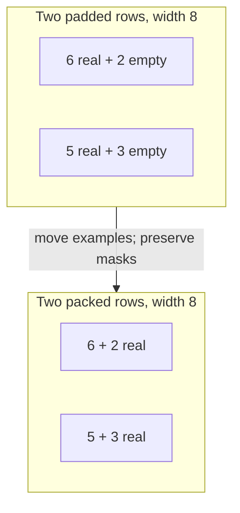

# Diagram — Sequence Packing — Stop Training on Empty Space


```mermaid
flowchart TB
    subgraph Padded["Two padded rows, width 8"]
      P1["6 real + 2 empty"]
      P2["5 real + 3 empty"]
    end
    subgraph Packed["Two packed rows, width 8"]
      K1["6 + 2 real"]
      K2["5 + 3 real"]
    end
    Padded -->|"move examples; preserve masks"| Packed
```

```text
before: T T T T T T _ _   T T T T T _ _ _
after:  T T T T T T T T   T T T T T T T T
```
