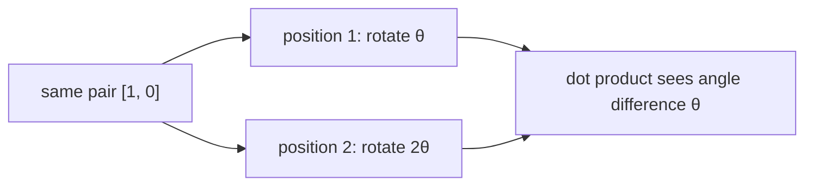

# Diagram — Rotary Position Embeddings — Let Distance Enter the Match


```mermaid
flowchart LR
    V["same pair [1, 0]"] --> P1["position 1: rotate θ"]
    V --> P2["position 2: rotate 2θ"]
    P1 --> R["dot product sees angle difference θ"]
    P2 --> R
```

```text
position 0:  ->
position 1:  ↑
position 2:  <-     length stays fixed; angle carries position
```
