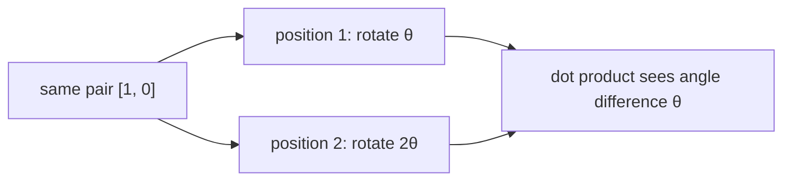

# Diagram — Rotary Position Embeddings — Let Distance Enter the Match



```text
position 0:  ->
position 1:  ↑
position 2:  <-     length stays fixed; angle carries position
```

<!-- memory-film-v1:start -->
## Five-frame memory film

```text
QUESTION       What fails if we learn an unrelated vector for every absolute position and hope the model infers all relative distances from examples?
     ↓
OBJECT         the rotary position embeddings wheel mounted on the brass reference machine
     ↓
VISIBLE BREAK  The wheel follows the tempting path—learn an unrelated vector for every absolute position and hope the model infers all relative distances from examples. Then the evidence answers: moving the same phrase from positions 10–12 to 110–112 changes every position vector although the internal distances are unchanged.
     ↓
TRANSFORMATION The enginewright changes one moving part. The wheel can now rotate pairs of query and key coordinates by a position-dependent angle so their dot product naturally depends on the angle difference.
     ↓
MEMORY SEAL    Rotary Position Embeddings keeps the missing power: rotate pairs of query and key coordinates by a position-dependent angle so their dot product naturally depends on the angle difference.
```
<!-- memory-film-v1:end -->
