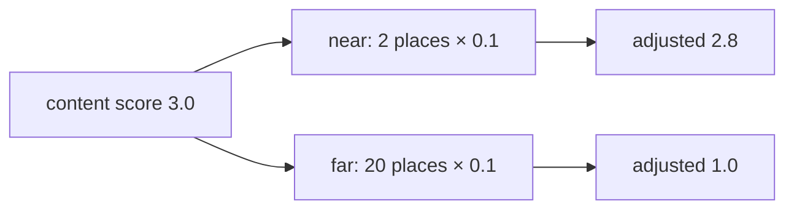

# Diagram — Relative Position Bias — What Should Happen Beyond the Seen Window?



```text
content may overcome distance, but distance now has a predictable price
```

<!-- memory-film-v1:start -->
## Five-frame memory film

```text
QUESTION       What Should Happen Beyond the Seen Window?
     ↓
OBJECT         the relative position bias map mounted on the brass reference machine
     ↓
VISIBLE BREAK  The map follows the tempting path—trust every unseen distance to behave like familiar distances merely because the formula can compute an angle there. Then the evidence answers: a mathematically defined position is not necessarily a learned behavior; attention can become erratic at unfamiliar separations.
     ↓
TRANSFORMATION The enginewright changes one moving part. The map can now add an explicit distance-dependent penalty whose direction continues beyond the training window, then measure the quality trade rather than assuming extrapolation.
     ↓
MEMORY SEAL    Relative Position Bias keeps the missing power: add an explicit distance-dependent penalty whose direction continues beyond the training window, then measure the quality trade rather than assuming extrapolation.
```
<!-- memory-film-v1:end -->
