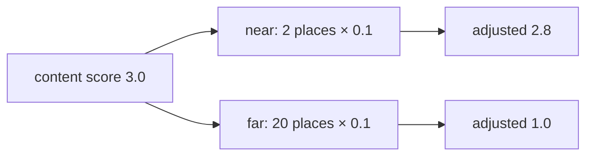

# Diagram — Relative Position Bias — What Should Happen Beyond the Seen Window?


```mermaid
flowchart LR
    S["content score 3.0"] --> N["near: 2 places × 0.1"]
    S --> F["far: 20 places × 0.1"]
    N --> AN["adjusted 2.8"]
    F --> AF["adjusted 1.0"]
```

```text
content may overcome distance, but distance now has a predictable price
```
