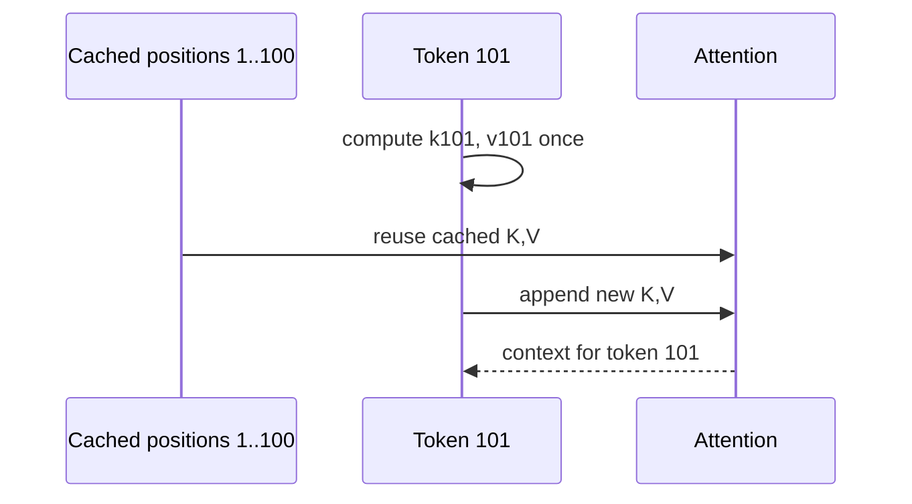

# Diagram — The KV Cache — Stop Re-reading the Entire Past


```mermaid
sequenceDiagram
    participant Past as Cached positions 1..100
    participant New as Token 101
    participant Attention
    New->>New: compute k101, v101 once
    Past->>Attention: reuse cached K,V
    New->>Attention: append new K,V
    Attention-->>New: context for token 101
```

```text
without cache: 1 + 2 + ... + 100 projections
with cache:    1 new projection at each step
```
