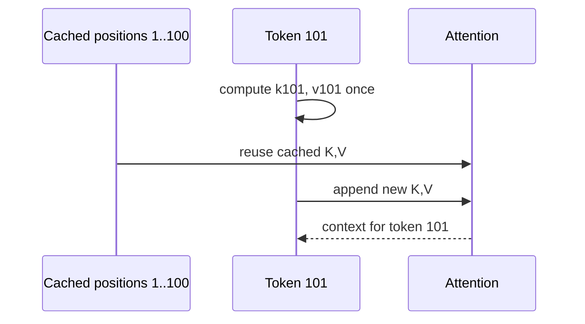

# Diagram — The KV Cache — Stop Re-reading the Entire Past



```text
without cache: 1 + 2 + ... + 100 projections
with cache:    1 new projection at each step
```

<!-- memory-film-v1:start -->
## Five-frame memory film

```text
QUESTION       What fails if we at step t, recompute keys and values for positions 1 through t because the prefix is presented again?
     ↓
OBJECT         the kv cache scale mounted on the brass reference machine
     ↓
VISIBLE BREAK  The scale follows the tempting path—at step t, recompute keys and values for positions 1 through t because the prefix is presented again. Then the evidence answers: past token representations are unchanged in causal decoding, so the same projections are calculated repeatedly while one new token is added.
     ↓
TRANSFORMATION The enginewright changes one moving part. The scale can now store each layer's past keys and values once, append only the new pair, and let the new query attend to the cache.
     ↓
MEMORY SEAL    The KV Cache keeps the missing power: store each layer's past keys and values once, append only the new pair, and let the new query attend to the cache.
```
<!-- memory-film-v1:end -->
