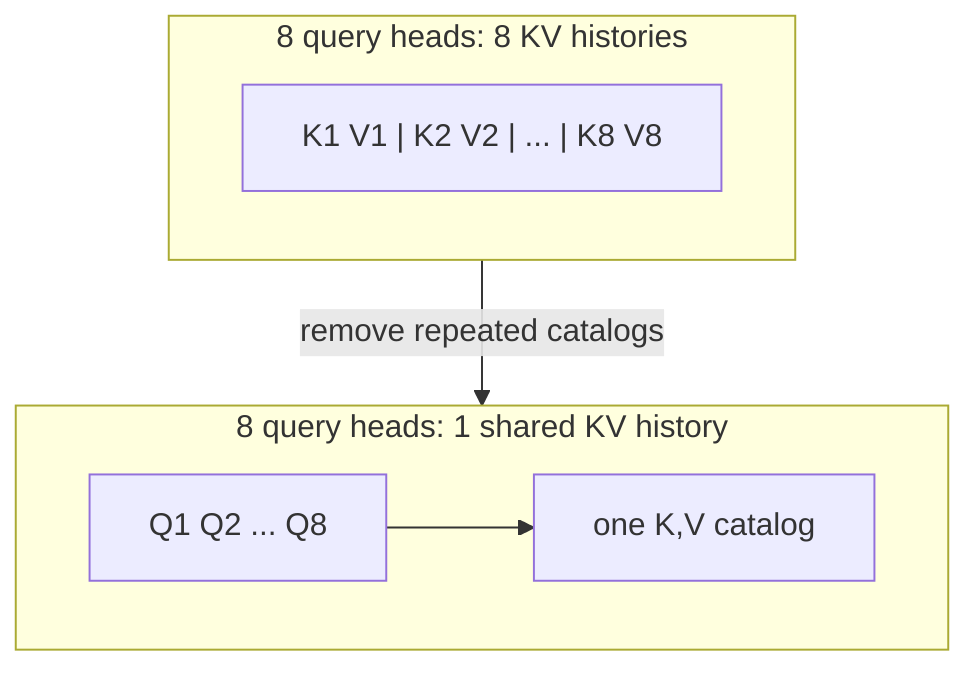

# Diagram — Multi-Query Attention — Why Cache Separate Copies for Every Head?



```text
cache width: 8 heads -> 1 head
```

<!-- memory-film-v1:start -->
## Five-frame memory film

```text
QUESTION       Why Cache Separate Copies for Every Head?
     ↓
OBJECT         the multi-query attention gear mounted on the brass reference machine
     ↓
VISIBLE BREAK  The gear follows the tempting path—preserve one complete KV cache for each query head because multi-head attention originally gave every head private projections. Then the evidence answers: the caches grow with both sequence length and head count, and loading them dominates the arithmetic for one new token.
     ↓
TRANSFORMATION The enginewright changes one moving part. The gear can now keep many query heads but share one key head and one value head across them.
     ↓
MEMORY SEAL    Multi-Query Attention keeps the missing power: keep many query heads but share one key head and one value head across them.
```
<!-- memory-film-v1:end -->
