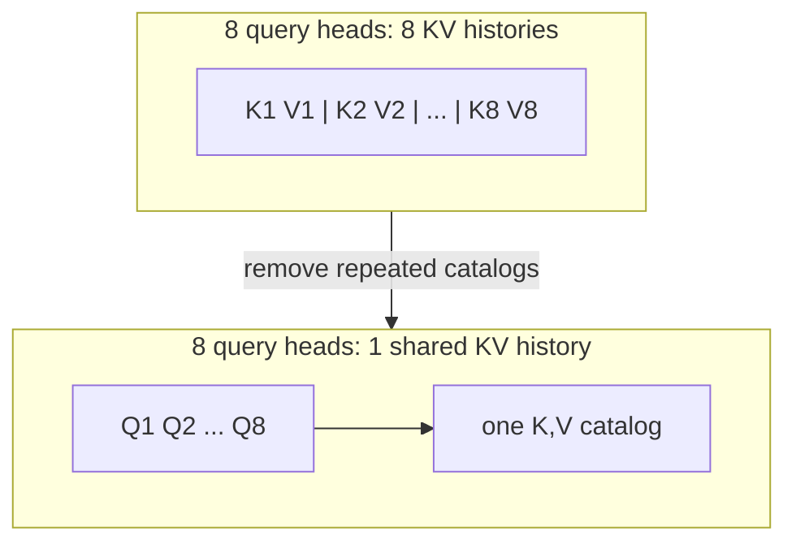

# Diagram — Multi-Query Attention — Why Cache Separate Copies for Every Head?


```mermaid
flowchart TB
    subgraph MHA["8 query heads: 8 KV histories"]
      M["K1 V1 | K2 V2 | ... | K8 V8"]
    end
    subgraph MQA["8 query heads: 1 shared KV history"]
      Q["Q1 Q2 ... Q8"] --> K["one K,V catalog"]
    end
    MHA -->|"remove repeated catalogs"| MQA
```

```text
cache width: 8 heads -> 1 head
```
