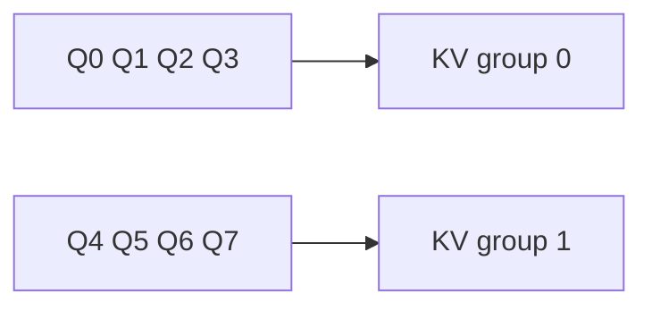

# Diagram — Grouped-Query Attention — Recover Some Specialist Memory



```text
MQA:  8 queries -> 1 catalog
GQA:  8 queries -> 2 catalogs
MHA:  8 queries -> 8 catalogs
```

<!-- memory-film-v1:start -->
## Five-frame memory film

```text
QUESTION       What fails if we return immediately to one KV head per query head?
     ↓
OBJECT         the grouped-query attention prism mounted on the brass reference machine
     ↓
VISIBLE BREAK  The prism follows the tempting path—return immediately to one KV head per query head. Then the evidence answers: quality recovers, but so does the full cache and bandwidth cost that forced sharing.
     ↓
TRANSFORMATION The enginewright changes one moving part. The prism can now partition query heads into groups; queries remain distinct while each group shares one key-value head.
     ↓
MEMORY SEAL    Grouped-Query Attention keeps the missing power: partition query heads into groups; queries remain distinct while each group shares one key-value head.
```
<!-- memory-film-v1:end -->
