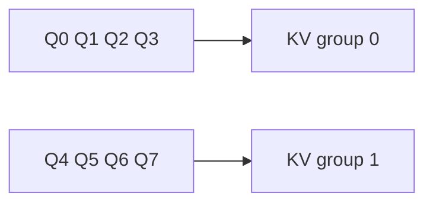

# Diagram — Grouped-Query Attention — Recover Some Specialist Memory


```mermaid
flowchart LR
    Q0["Q0 Q1 Q2 Q3"] --> KV0["KV group 0"]
    Q1["Q4 Q5 Q6 Q7"] --> KV1["KV group 1"]
```

```text
MQA:  8 queries -> 1 catalog
GQA:  8 queries -> 2 catalogs
MHA:  8 queries -> 8 catalogs
```
