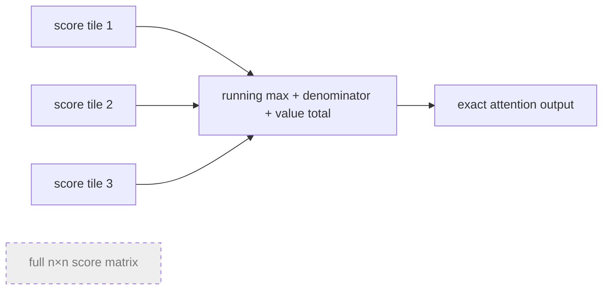

# Diagram — FlashAttention — The Arithmetic Was Not the Bottleneck


```mermaid
flowchart LR
    T1["score tile 1"] --> O["running max + denominator + value total"]
    T2["score tile 2"] --> O
    T3["score tile 3"] --> O
    O --> A["exact attention output"]
    X["full n×n score matrix"]:::gone
    classDef gone stroke-dasharray: 5 5,fill:#eee,color:#777
```

```text
slow memory: never stores the whole score square
fast memory: one tile + three running summaries
```
