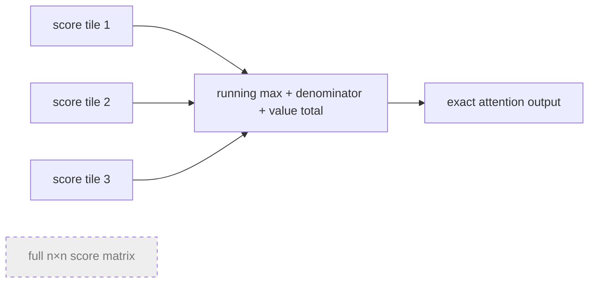

# Diagram — FlashAttention — The Arithmetic Was Not the Bottleneck



```text
slow memory: never stores the whole score square
fast memory: one tile + three running summaries
```

<!-- memory-film-v1:start -->
## Five-frame memory film

```text
QUESTION       What fails if we reduce arithmetic by approximating attention, because the n-squared score matrix appears to be the unavoidable cost?
     ↓
OBJECT         the flashattention seal mounted on the brass reference machine
     ↓
VISIBLE BREAK  The seal follows the tempting path—reduce arithmetic by approximating attention, because the n-squared score matrix appears to be the unavoidable cost. Then the evidence answers: approximation changes the model, while profiling shows much of the time is spent writing and rereading exact intermediate scores rather than multiplying them.
     ↓
TRANSFORMATION The enginewright changes one moving part. The seal can now tile queries, keys, and values into fast on-chip memory and maintain an online softmax so exact attention never needs the whole score matrix stored at once.
     ↓
MEMORY SEAL    FlashAttention keeps the missing power: tile queries, keys, and values into fast on-chip memory and maintain an online softmax so exact attention never needs the whole score matrix stored at once.
```
<!-- memory-film-v1:end -->
