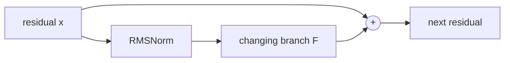

# Diagram — Pre-Normalization — Protect the Residual Highway


```mermaid
flowchart LR
    X["residual x"] --> ADD(("+"))
    X --> N["RMSNorm"] --> F["changing branch F"] --> ADD
    ADD --> Y["next residual"]
```

```text
identity highway: x --------------------> +
changing branch: x -> norm -> F --------> +
```
