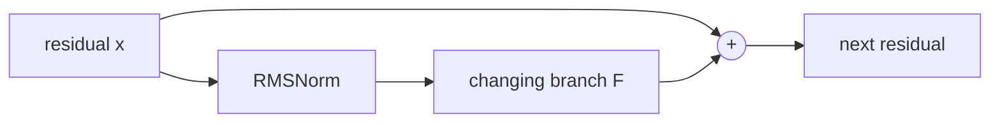

# Diagram — Pre-Normalization — Protect the Residual Highway



```text
identity highway: x --------------------> +
changing branch: x -> norm -> F --------> +
```

<!-- memory-film-v1:start -->
## Five-frame memory film

```text
QUESTION       What fails if we keep post-normalization because each block's output then looks standardized before the next block?
     ↓
OBJECT         the pre-normalization key mounted on the brass reference machine
     ↓
VISIBLE BREAK  The key follows the tempting path—keep post-normalization because each block's output then looks standardized before the next block. Then the evidence answers: the supposedly clean output places normalization directly on the identity route every gradient must cross, making the long residual path harder to preserve.
     ↓
TRANSFORMATION The enginewright changes one moving part. The key can now normalize only the input to the changing branch and let the identity stream pass around it unchanged.
     ↓
MEMORY SEAL    Pre-Normalization keeps the missing power: normalize only the input to the changing branch and let the identity stream pass around it unchanged.
```
<!-- memory-film-v1:end -->
