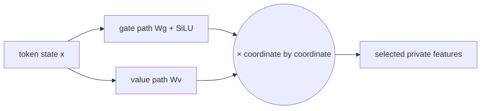

# Diagram — SwiGLU — Let One Learned Path Gate Another



```text
closed gate 0 × content 5 = 0
open gate   1 × content 5 = 5
```

<!-- memory-film-v1:start -->
## Five-frame memory film

```text
QUESTION       What fails if we make the hidden layer merely wider and trust more coordinates to express every conditional interaction?
     ↓
OBJECT         the swiglu lantern mounted on the brass reference machine
     ↓
VISIBLE BREAK  The lantern follows the tempting path—make the hidden layer merely wider and trust more coordinates to express every conditional interaction. Then the evidence answers: width adds capacity but still asks one projection both to create content and decide when that content matters.
     ↓
TRANSFORMATION The enginewright changes one moving part. The lantern can now create one content projection and one gate projection; use the smooth gate to scale content feature by feature.
     ↓
MEMORY SEAL    SwiGLU keeps the missing power: create one content projection and one gate projection; use the smooth gate to scale content feature by feature.
```
<!-- memory-film-v1:end -->
