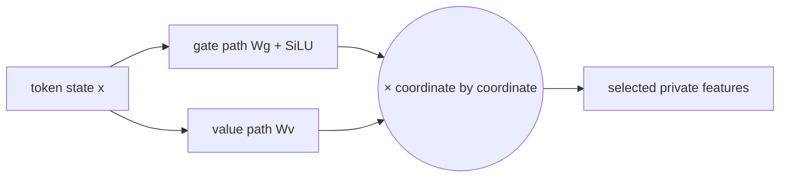

# Diagram — SwiGLU — Let One Learned Path Gate Another


```mermaid
flowchart LR
    X["token state x"] --> G["gate path Wg + SiLU"]
    X --> V["value path Wv"]
    G --> MUL(("× coordinate by coordinate"))
    V --> MUL
    MUL --> O["selected private features"]
```

```text
closed gate 0 × content 5 = 0
open gate   1 × content 5 = 5
```
