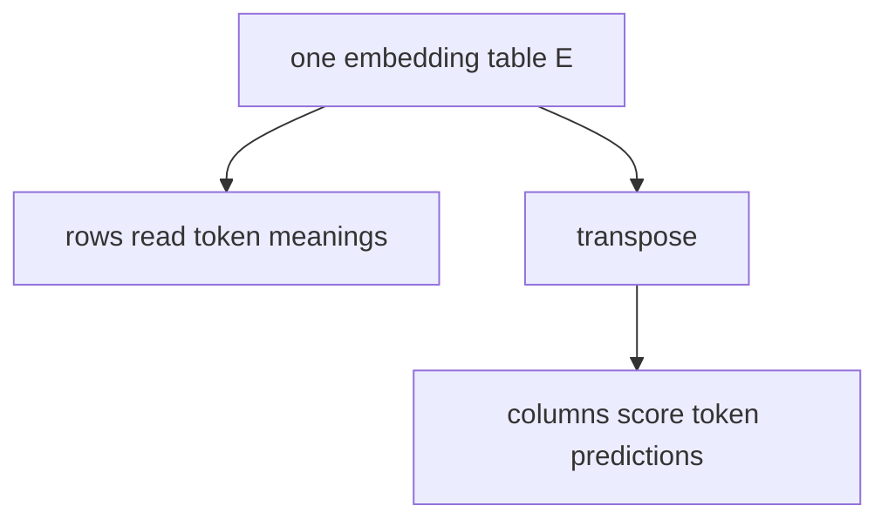

# Diagram — Weight Tying — Use One Word Geometry Twice


```mermaid
flowchart TB
    E["one embedding table E"] --> IN["rows read token meanings"]
    E --> T["transpose"] --> OUT["columns score token predictions"]
```

```text
enter "tiger": read tiger row
predict "tiger": align with that same row turned into a column
```
