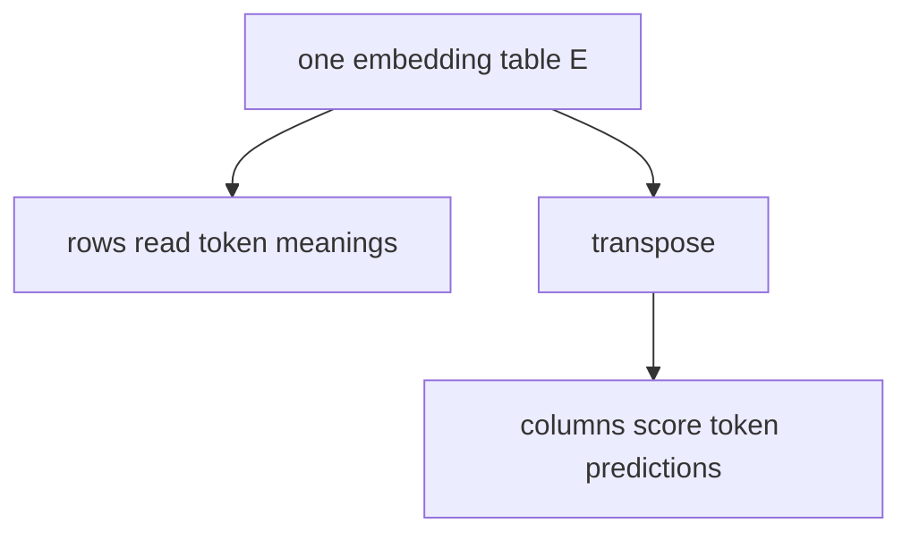

# Diagram — Weight Tying — Use One Word Geometry Twice



```text
enter "tiger": read tiger row
predict "tiger": align with that same row turned into a column
```

<!-- memory-film-v1:start -->
## Five-frame memory film

```text
QUESTION       What fails if we let both matrices learn independently because reading a token and predicting it are different jobs?
     ↓
OBJECT         the weight tying compass mounted on the brass reference machine
     ↓
VISIBLE BREAK  The compass follows the tempting path—let both matrices learn independently because reading a token and predicting it are different jobs. Then the evidence answers: the model spends parameters learning two unrelated geometries for the same set of word identities, and rare tokens receive weak evidence in both places.
     ↓
TRANSFORMATION The enginewright changes one moving part. The compass can now reuse the embedding table transposed as the output scoring matrix, while retaining any necessary output bias.
     ↓
MEMORY SEAL    Weight Tying keeps the missing power: reuse the embedding table transposed as the output scoring matrix, while retaining any necessary output bias.
```
<!-- memory-film-v1:end -->
