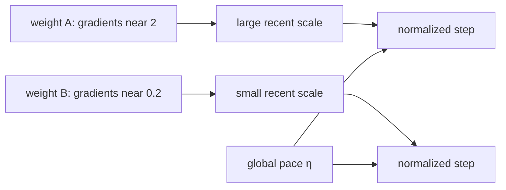

# Diagram — Adam — Give Each Parameter Its Own Step Scale


```mermaid
flowchart LR
    G1["weight A: gradients near 2"] --> M1["large recent scale"] --> S1["normalized step"]
    G2["weight B: gradients near 0.2"] --> M2["small recent scale"] --> S2["normalized step"]
    ETA["global pace η"] --> S1
    ETA --> S2
```

```text
raw size differs -> each weight compares advice with its own history
```
