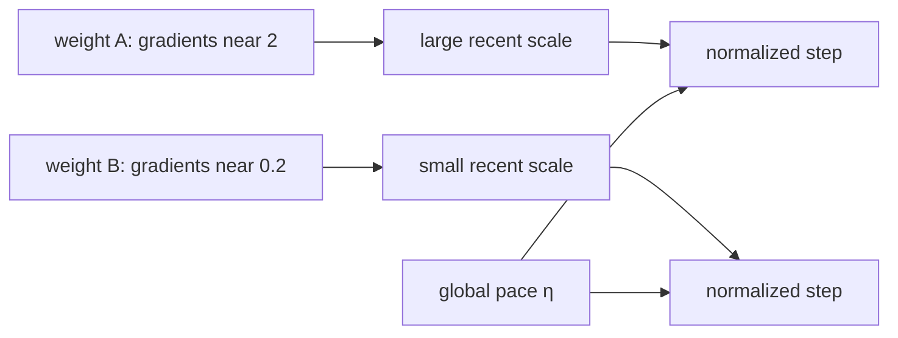

# Diagram — Adam — Give Each Parameter Its Own Step Scale



```text
raw size differs -> each weight compares advice with its own history
```

<!-- memory-film-v1:start -->
## Five-frame memory film

```text
QUESTION       What fails if we use the same raw gradient step scale for every parameter?
     ↓
OBJECT         the adam bridge mounted on the brass reference machine
     ↓
VISIBLE BREAK  The bridge follows the tempting path—use the same raw gradient step scale for every parameter. Then the evidence answers: a rate safe for frequent large gradients barely moves sparse coordinates; a rate large enough for sparse coordinates makes noisy ones unstable.
     ↓
TRANSFORMATION The enginewright changes one moving part. The bridge can now keep fading memories of gradient direction and squared gradient size, then scale each coordinate's step by its own recent magnitude.
     ↓
MEMORY SEAL    Adam keeps the missing power: keep fading memories of gradient direction and squared gradient size, then scale each coordinate's step by its own recent magnitude.
```
<!-- memory-film-v1:end -->
