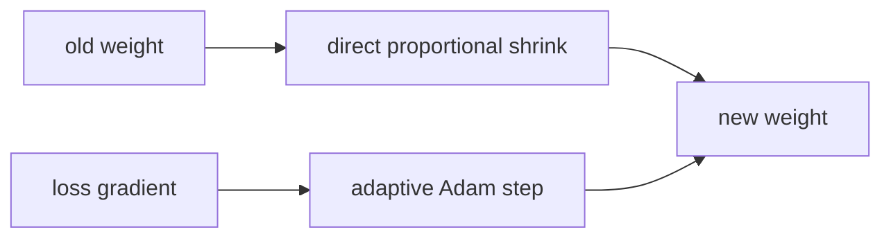

# Diagram — AdamW — Keep Shrinkage Separate from Adaptation


```mermaid
flowchart LR
    OLD["old weight"] --> DECAY["direct proportional shrink"] --> JOIN["new weight"]
    DATA["loss gradient"] --> ADAM["adaptive Adam step"] --> JOIN
```

```text
weight decay answers: how much smaller should the weight be?
Adam answers: what did the data ask it to change?
```
