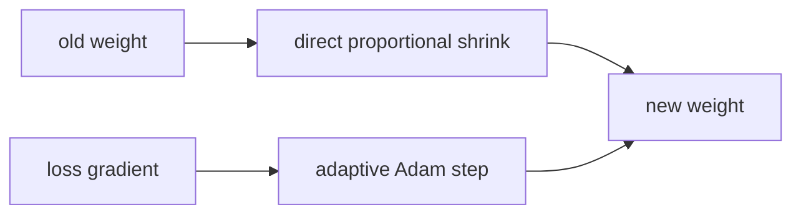

# Diagram — AdamW — Keep Shrinkage Separate from Adaptation



```text
weight decay answers: how much smaller should the weight be?
Adam answers: what did the data ask it to change?
```

<!-- memory-film-v1:start -->
## Five-frame memory film

```text
QUESTION       What fails if we treat penalty gradients and data gradients identically because both appear in one total loss?
     ↓
OBJECT         the adamw thread mounted on the brass reference machine
     ↓
VISIBLE BREAK  The thread follows the tempting path—treat penalty gradients and data gradients identically because both appear in one total loss. Then the evidence answers: coordinates with different gradient histories receive different effective shrinkage even when the intended rule was to decay all selected weights at one rate.
     ↓
TRANSFORMATION The enginewright changes one moving part. The thread can now apply Adam's adaptive data update and parameter decay as separate operations.
     ↓
MEMORY SEAL    AdamW keeps the missing power: apply Adam's adaptive data update and parameter decay as separate operations.
```
<!-- memory-film-v1:end -->
