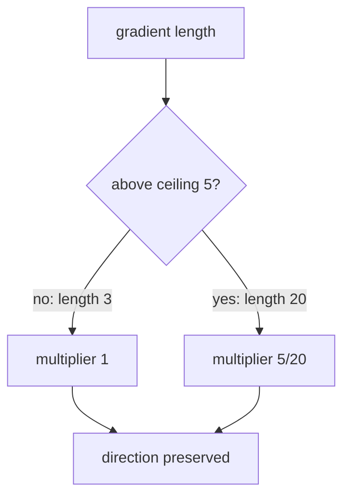

# Diagram — Gradient Clipping — Stop One Shock from Becoming a Catastrophe


```mermaid
flowchart TD
    G["gradient length"] --> Q{"above ceiling 5?"}
    Q -->|"no: length 3"| KEEP["multiplier 1"]
    Q -->|"yes: length 20"| SCALE["multiplier 5/20"]
    KEEP --> OUT["direction preserved"]
    SCALE --> OUT
```

```text
[12,16] length 20 -> × 1/4 -> [3,4] length 5
```
