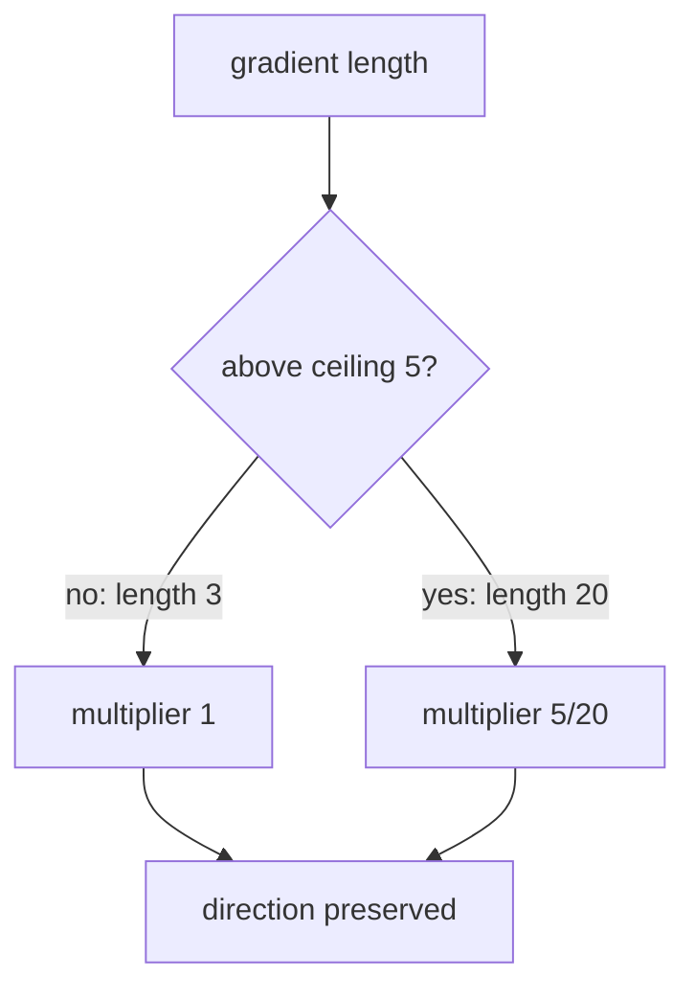

# Diagram — Gradient Clipping — Stop One Shock from Becoming a Catastrophe



```text
[12,16] length 20 -> × 1/4 -> [3,4] length 5
```

<!-- memory-film-v1:start -->
## Five-frame memory film

```text
QUESTION       What fails if we discard the entire batch whenever any gradient coordinate looks large?
     ↓
OBJECT         the gradient clipping mirror mounted on the brass reference machine
     ↓
VISIBLE BREAK  The mirror follows the tempting path—discard the entire batch whenever any gradient coordinate looks large. Then the evidence answers: useful directional evidence is lost, and one arbitrary coordinate threshold ignores the size of the full update vector.
     ↓
TRANSFORMATION The enginewright changes one moving part. The mirror can now preserve the gradient's direction but scale its whole norm down only when it exceeds a chosen ceiling.
     ↓
MEMORY SEAL    Gradient Clipping keeps the missing power: preserve the gradient's direction but scale its whole norm down only when it exceeds a chosen ceiling.
```
<!-- memory-film-v1:end -->
