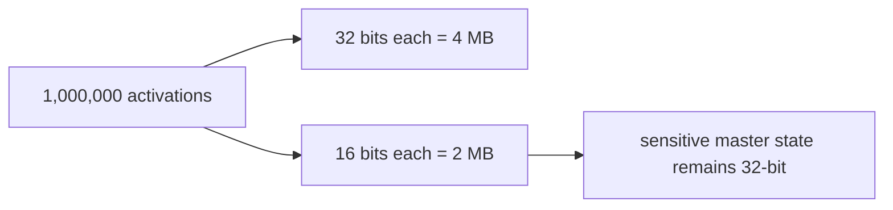

# Diagram — Mixed Precision — Stop Storing Every Number with Unneeded Detail


```mermaid
flowchart LR
    N["1,000,000 activations"] --> F32["32 bits each = 4 MB"]
    N --> F16["16 bits each = 2 MB"]
    F16 --> MASTER["sensitive master state remains 32-bit"]
```

```text
bulk arithmetic: narrow   |   fragile accumulation: wide
```
