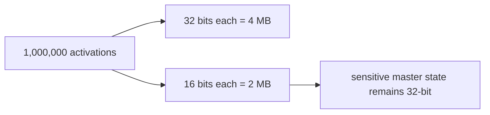

# Diagram — Mixed Precision — Stop Storing Every Number with Unneeded Detail



```text
bulk arithmetic: narrow   |   fragile accumulation: wide
```

<!-- memory-film-v1:start -->
## Five-frame memory film

```text
QUESTION       What fails if we convert every value and every update permanently to half precision?
     ↓
OBJECT         the mixed precision bell mounted on the brass reference machine
     ↓
VISIBLE BREAK  The bell follows the tempting path—convert every value and every update permanently to half precision. Then the evidence answers: small updates disappear when rounded into large weights, and some intermediate values overflow or underflow the smaller numeric range.
     ↓
TRANSFORMATION The enginewright changes one moving part. The bell can now use reduced precision for bulk arithmetic while keeping selected master state and sensitive reductions in wider precision.
     ↓
MEMORY SEAL    Mixed Precision keeps the missing power: use reduced precision for bulk arithmetic while keeping selected master state and sensitive reductions in wider precision.
```
<!-- memory-film-v1:end -->
