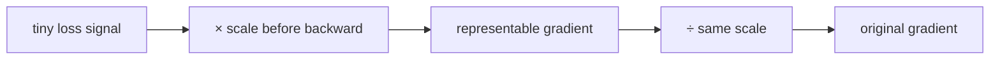

# Diagram — Loss Scaling — Rescue Gradients Too Small to Represent



```text
0.000001 -> ×1000 -> 0.001 -> survive -> ÷1000 -> 0.000001
```

<!-- memory-film-v1:start -->
## Five-frame memory film

```text
QUESTION       What fails if we increase the learning rate so small updates become visible?
     ↓
OBJECT         the loss scaling vessel mounted on the brass reference machine
     ↓
VISIBLE BREAK  The vessel follows the tempting path—increase the learning rate so small updates become visible. Then the evidence answers: the learning rate acts after gradients are formed; it cannot recover values that already underflowed to zero, and it enlarges every surviving update.
     ↓
TRANSFORMATION The enginewright changes one moving part. The vessel can now multiply the loss before backpropagation so gradients are representable, then divide the gradients by the same scale before clipping and updating.
     ↓
MEMORY SEAL    Loss Scaling keeps the missing power: multiply the loss before backpropagation so gradients are representable, then divide the gradients by the same scale before clipping and updating.
```
<!-- memory-film-v1:end -->
