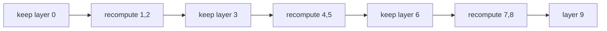

# Diagram — Activation Checkpointing — Remember Less, Recompute Exactly



```text
stored:      0       3       6
recomputed:    1 2     4 5     7 8
```

<!-- memory-film-v1:start -->
## Five-frame memory film

```text
QUESTION       What fails if we delete all activations after the forward pass?
     ↓
OBJECT         the activation checkpointing wheel mounted on the brass reference machine
     ↓
VISIBLE BREAK  The wheel follows the tempting path—delete all activations after the forward pass. Then the evidence answers: backward computation then lacks the local values needed for its derivatives and would require rebuilding the entire prefix repeatedly.
     ↓
TRANSFORMATION The enginewright changes one moving part. The wheel can now keep selected checkpoint activations and recompute the missing segments once when backward reaches them.
     ↓
MEMORY SEAL    Activation Checkpointing keeps the missing power: keep selected checkpoint activations and recompute the missing segments once when backward reaches them.
```
<!-- memory-film-v1:end -->
